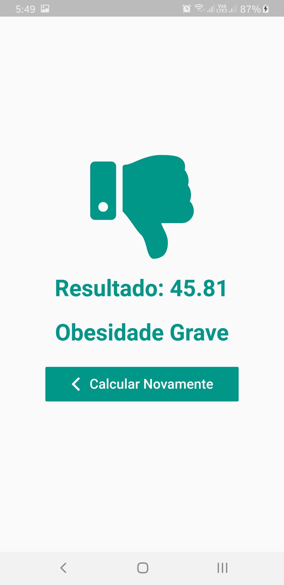

<h1 align = "center">Calculadora de IMC com Slider</h1>
 

Consiste em uma simples calculadora de IMC feita com [Flutter](https://flutter.dev/), usando o Widget [Slider](https://api.flutter.dev/flutter/material/Slider-class.html).

Se faz uso do padrão Bloc no projeto e dos *packages* [Font Awesome Flutter](https://pub.dev/packages/font_awesome_flutter) e o [RxDart](https://pub.dev/packages/rxdart) que da acesso a programação reativa.

   

        
        
        
        
    

